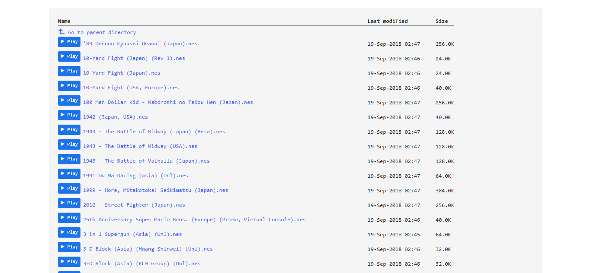
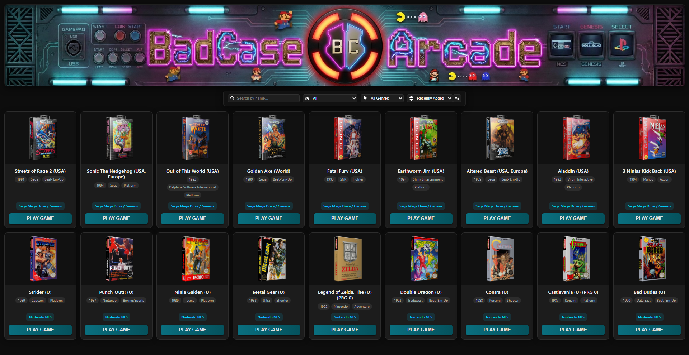

# Retro Arcade Browser Extension

 <!-- Replace with your actual icon path -->

**Retro Arcade** is a browser extension that 
---

## 📖 Table of Contents

- [Key Features](#key-features)  
- [Screenshots](#screenshots)  
- [Installation](#installation)  

---

## Key Features

- **Smart ROM Detection**: Scans any webpage instantly for links to common ROM file extensions.

- **One-Click Play**: Injects a "Play" button directly next to detected links for immediate access.

- **Native Browser Emulator**: Launches games directly in your browser—no external software or setup required.

- **Dynamic Arcade Dashboard**: Automatically saves played ROMs to a sleek, searchable library.

- **Custom Library Curation**: Personalize your collection by editing box art and ROM titles within the dashboard.

- **Platform Compatibility**: Optimized for a seamless experience across both desktop and mobile browsers.

---

## Screenshots

**Injected Buttons**  

**User Dashboard**  

---

## Installation

### Chrome Desktop (Recommended for Desktop)

1. Download the latest ZIP release from [Releases](https://github.com/BadCaseDotOrg/RetroArcade/releases).
2. Open Chrome and navigate to `chrome://extensions/`.
3. Enable **Developer mode** (toggle top-right).
4. Click **Load unpacked** and select the extracted folder from the ZIP.

---

### Firefox Nightly Desktop (using CRX Installer)

1. Download the latest CRX release from [Releases](https://github.com/BadCaseDotOrg/RetroArcade/releases).
2. Download and install **Firefox Nightly**:  
   - **Desktop:** [Firefox Nightly for Windows/macOS/Linux](https://www.mozilla.org/firefox/channel/desktop/)
3. Install the **CRX Installer** add-on from [Mozilla Add-ons](https://addons.mozilla.org/en-US/firefox/addon/crxinstaller/).
4. Go to `about:config` in the address bar and disable `xpinstall.signatures.required` to allow unsigned extensions.
5. Open **CRX Installer** from the Firefox extension menu, tap **Choose File**, and select the downloaded CRX file, a prompt will appear to install the extension.
6. The extension will now appear in your add-ons list and is active.

---

### Edge Canary (Recommended for Mobile)

1. Download the latest **CRX** release from [Releases](https://github.com/BadCaseDotOrg/RetroArcade/releases).
2. Open **[Edge Canary](https://play.google.com/store/apps/details?id=com.microsoft.emmx.canary)**.
3. Open the **Settings** menu and select "About Microsoft Edge".
4. Tap the **version number** at the bottom until a message appears saying that **Developer options** are enabled.
5. Go back to the **Settings** menu and select **Developer options** at the bottom.
6. Select **Extension install by crx**.
7. Press **Choose .crx file** and select the extensions **.crx** file then press **OK**.
8. Press **Add**, the extension will now be installed and appear in your **Edge Canary** extensions list.

---

### Lemur

1. Download the latest **ZIP** release from [Releases](https://github.com/BadCaseDotOrg/RetroArcade/releases).
2. Open **[Lemur](https://play.google.com/store/apps/details?id=com.lemurbrowser.exts)**.
3. Press the **icon with 4 squares** at the bottom of Lemur's screen.
4. Press **Extensions**.
5. Toggle **Developer mode** on in the upper right corner.
6. Press  **Load *.zip/*.crx/*.user.js file.**.
7. Select the extensions **.zip** file.
8. The extension will now be installed and appear in your **Lemur** extensions list.

---

### Yandex

1. Download the latest **ZIP** release from [Releases](https://github.com/BadCaseDotOrg/RetroArcade/releases).
2. Unzip the extensions **.zip** file.
3. Open **[Yandex](https://play.google.com/store/apps/details?id=com.yandex.browser)** and enter **chrome://extensions** in the address bar.
4. Toggle **Developer mode** on in the upper right corner.
5. Press **Load unpacked**.
6. Select the directory the extension was unzipped to.
7. Press **Accept**.
8. The extension will now be installed and appear in your **Yandex** extensions list.

---

### Quetta Mobile

1. Download the latest ZIP release from [Releases](https://github.com/BadCaseDotOrg/RetroArcade/releases).
2. Open **[Quetta Mobile](https://play.google.com/store/apps/details?id=net.quetta.browser)**, go to **Settings → Extensions**, and scroll to the bottom and select **Developer options**.
3. Enable **Developer mode** (toggle in the upper right).
4. Tap **(from .zip/.crx/.user.js)** and select the downloaded ZIP file.
5. The extension will now be installed and appear in your Quetta extensions list.

---

### Firefox Nightly Mobile (using CRX Installer)

1. Download the latest CRX release from [Releases](https://github.com/BadCaseDotOrg/RetroArcade/releases).
2. Download and install **Firefox Nightly**:  
   - **Android:** [Firefox Nightly for Developers on Google Play](https://play.google.com/store/apps/details?id=org.mozilla.fenix)
3. Install the **CRX Installer** add-on from [Mozilla Add-ons](https://addons.mozilla.org/en-US/firefox/addon/crxinstaller/).
4. Go to `about:config` in the address bar and disable `xpinstall.signatures.required` to allow unsigned extensions.
5. Open **CRX Installer** from the Firefox extension menu, tap **Choose File**, and select the downloaded CRX file — it will automatically create a `.xpi` file.
6. Enable the **Debug menu** in Firefox Nightly:  
   - Go to **Settings → About Firefox Nightly**.
   - Tap the **Firefox logo** multiple times until you see “Debug menu enabled”.
7. Go back to **Settings → Install extension from file**, and select the `.xpi` file that CRX Installer created.
8. The extension will now appear in your add-ons list and is active.

